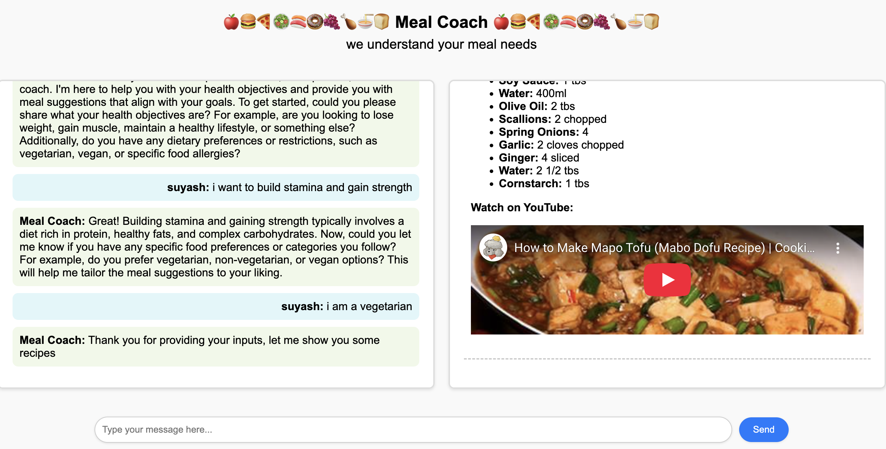
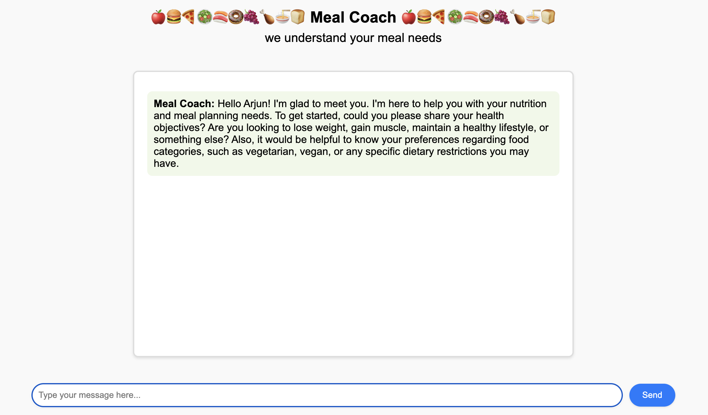
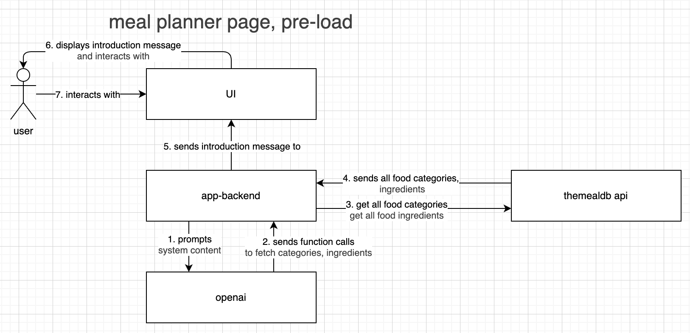

# MealCoach


## Project Overview
MealCoach is a personalized meal planning application designed to help users create healthy, balanced, and customized meal plans. By leveraging AI and external APIs, MealCoach provides users with tailored meal suggestions based on their dietary preferences, restrictions, and goals.

## Features

- **Personalized Meal Plans**: Generate meal plans based on user preferences, including dietary restrictions, and cuisine types.
- **Recipe Suggestions**: Access a wide variety of recipes sourced from [TheMealDB API](https://www.themealdb.com/api.php).
- **Interactive User Interface**: A clean and intuitive web interface for users to easily navigate and plan their meals. The User can restart the conversation at any time.
- **AI-Powered Recommendations**: Utilize AI to suggest meals that align with user preferences and nutritional goals. Moderation checks are performed to ensure user input is appropriate.

## How It Works

1. **Input Preferences**: Users provide their dietary preferences, restrictions, and goals.
2. **AI Processing**: The application uses AI to analyze the input and generate meal suggestions.
3. **Recipe Integration**: Recipes are fetched from TheMealDB API and displayed to the user.
4. **Meal Plan Generation**: Users can view and customize their meal plans.

## User Experience

### Home Page


### Home Page inappropriate username


### Meal Planner introduction


### Meal Planner recommendations


### Start over the conversation


### Inappropriate conversation


## Challenges Faced
One of the key challenges faced during the development of MealCoach was integrating recipe suggestions from both OpenAI's language model (LLM) and TheMealDB API. While the LLM provides diverse and personalized recipe recommendations, TheMealDB API offers detailed cooking instructions and YouTube video links, which are essential for an enhanced user experience.

To address this, we decided to use only the "main ingredient" from the LLM's recommendations and fetch corresponding recipes from TheMealDB API. This approach ensures that users receive recipes with complete instructions and multimedia support, while still leveraging the personalization capabilities of the LLM.

### Future Scope
In the future, we aim to improve the matching process between the LLM's recipe responses and the recipes available in TheMealDB API. This could involve advanced natural language processing techniques to better align the LLM's suggestions with the API's database, ensuring even more accurate and tailored meal recommendations.

# Technical Details

## Getting Started

1. Clone the repository and add your own OPENAI_API_KEY.txt in the mealcoach-app directory.:
   ```bash
   git clone https://github.com/yourusername/mealcoach.git
   cd mealcoach/mealcoach-app
   pip install -r requirements.txt
   python app.py
   ```

## Folder Structure

- `mealcoach-app/`: Contains the main application code.
  - `app.py`: The Flask application entry point.
  - `mealcoachai.py`: AI logic for meal recommendations.
  - `themealdbapi.py`: Handles integration with TheMealDB API.
  - `templates/`: HTML templates for the web interface.
    - `index.html`: Homepage of the application.
    - `meal-planner.html`: Meal planning interface.
  - `requirements.txt`: Lists all dependencies required to run the application.

## System Design

The MealCoach application is designed with a modular architecture to ensure seamless interaction between the user, backend, and external APIs. Below is an overview of the system's architecture:

- **User Interface (UI)**: The user interacts with the application through a clean and intuitive web interface. The UI sends user queries to the backend and displays meal suggestions and plans based on the responses.
- **App Backend**: Acts as the core of the application, processing user queries, managing data flow, and coordinating with external APIs. It handles:
  - Communication with **TheMealDB API** to fetch recipe data, including food categories, ingredients, cooking instructions, images, and YouTube videos.
  - Integration with **OpenAI** for natural language processing, health objectives, and ingredient nutrition analysis.
- **TheMealDB API**: Provides a rich database of recipes and related information, which the backend uses to generate meal plans.
- **OpenAI**: Powers the AI-driven recommendations by analyzing user preferences and generating personalized meal suggestions.

This architecture ensures a smooth and efficient user experience by leveraging external APIs and AI capabilities.


## Technical Implementation

### User Interaction: Home Page

This diagram illustrates the user interaction flow on the home page of the MealCoach application:

1. **User Input**: The user provides a username through the UI.
2. **Validation**: The UI sends the username to the app backend for validation.
3. **Moderation Check**: The backend forwards the username to OpenAI for a moderation check to ensure it meets acceptable standards.
4. **Response Handling**:
   - If the username fails the moderation check, an error message is displayed on the UI.
   - If the username passes the moderation check, the backend redirects the user to the meal planner page.

This process ensures a safe and user-friendly experience by validating usernames before proceeding further.


### User Interaction: Meal Planner Page (Pre-Load)

This diagram illustrates the interaction flow when the Meal Planner page is pre-loaded in the MealCoach application:

1. **System Prompt**: The backend prompts OpenAI with system content to initialize the meal planning process.
2. **Function Calls**: OpenAI sends function calls to fetch food categories and ingredients.
3. **Data Retrieval**: The backend requests all food categories and ingredients from TheMealDB API.
4. **API Response**: TheMealDB API responds with the requested data (categories and ingredients).
5. **Introduction Message**: The backend sends an introduction message, along with the retrieved data, to the UI.
6. **UI Display**: The UI displays the introduction message to the user.
7. **User Interaction**: The user interacts with the Meal Planner page to begin customizing their meal plan.

This process ensures that the Meal Planner page is pre-loaded with all necessary data, providing a seamless and interactive user experience.

### Meal Planner Pre-Load



### User Interaction: Meal Planner Page (Regular Conversation)

This diagram illustrates the interaction flow during regular user interactions on the Meal Planner page of the MealCoach application:

1. **User Input**: The user provides health objectives and food preferences through the UI.
2. **Backend Processing**: The UI sends the user's input to the app backend.
3. **AI Analysis**: The backend forwards the health objectives and food preferences to OpenAI, which processes the input and responds with appropriate ingredients based on the user's health objectives.
4. **Recipe Retrieval**: The backend uses the processed ingredients to request recipes from TheMealDB API.
5. **API Response**: TheMealDB API responds with detailed recipe information.
6. **UI Display**: The backend sends the recipes to the UI, which displays them to the user.
7. **User Interaction**: The user interacts with the displayed recipes to further customize their meal plan.

This process ensures that the user receives personalized meal suggestions tailored to their health goals and preferences.

### Meal Planner Conversation


### App Backend details
